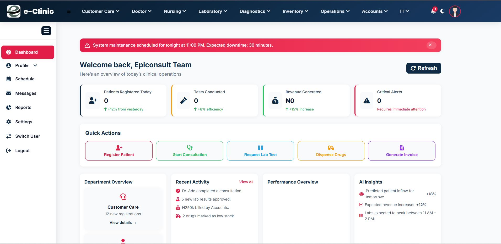

# 🏥 EPICONSULT e-Clinic Notification System

## 📸 Demo Screenshot



---

# 🔔 Smart Notification Center for e-Clinic Dashboard

The **Epiconsult e-Clinic Notification System** adds a sleek, Windows-style notification sidebar to the e-Clinic platform.  
It provides real-time alerts, smooth slide-in animations, and fully interactive, scrollable messages — designed to enhance internal workflow communication across departments.

---

## ⚙️ Key Features

- 🧭 **Slide-In Notification Panel** – Opens from the right with smooth transitions and blur overlay.  
- 🖱️ **Clickable Alerts** – Each message is actionable and linked to related sections.  
- 📜 **Scrollable Feed** – Automatically adapts to long notification lists.  
- ❌ **Quick Close Control** – Easily dismiss via close button or outside click.  
- 🌓 **Dark Mode Ready** – Seamlessly adapts to light and dark dashboard themes.  
- 🧩 **Responsive Layout** – Works perfectly on all mobile, tablet, and desktop screens.

---

## 🧠 Tech Stack

| Layer | Tools |
|-------|-------|
| **Frontend** | HTML, CSS (main.css), JavaScript (main.js) |
| **Framework** | e-Clinic UI Framework (Epiconsult Custom Build) |
| **Animations** | CSS3 Transitions, Font Awesome Icons |
| **Compatibility** | Fully responsive, dark/light theme adaptive |

---

## 🔧 Integration Steps

1. **Add the CSS Block**  
   Include the `.notif-slide-panel`, `.notif-overlay`, `.notif-header`, `.notif-body`, and `.notif-item` styles in `main.css`.

2. **Update Your JS File**  
   Insert the `WINDOWS-STYLE NOTIFICATION PANEL (Interactive & Scrollable)` block into `main.js`.

3. **Add the Trigger Button**  
   Place this inside your dashboard header:  
   ```html
   <button id="notifBtn"><i class="fa-solid fa-bell"></i></button>
